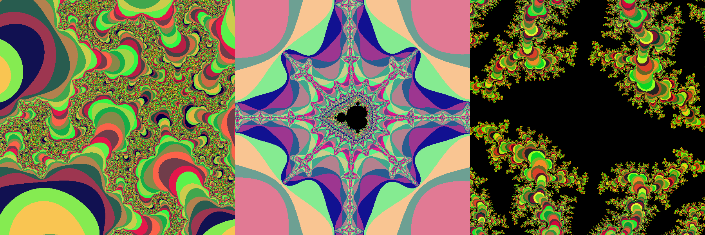

# Interative Mandelbrot Render

Scroll to zoom. Up arrow to increase maximum iterations (increase detail), down arrow to decrease. \
Execure `$ cargo run --release` 

Manipulates pixel data of an image and uses the rust bevy game engine to render it.
